<p align="center">
  
</p>

<h1 align="center">Cofre</h1>

<p align="center">
  <b>Banco digital completo em Java 21 + Spring Boot 4</b><br>
  Pix com QR Code (BR Code), cheque especial com juros diários, caixinhas, cartão virtual com CVV dinâmico<br>
  e um backoffice com perfis de <b>cliente</b>, <b>caixa</b> e <b>gerente</b>.
</p>

<p align="center">
  <a href="https://github.com/barbozadevti/cofre/actions/workflows/ci.yml"></a>
  
  
  
  
</p>

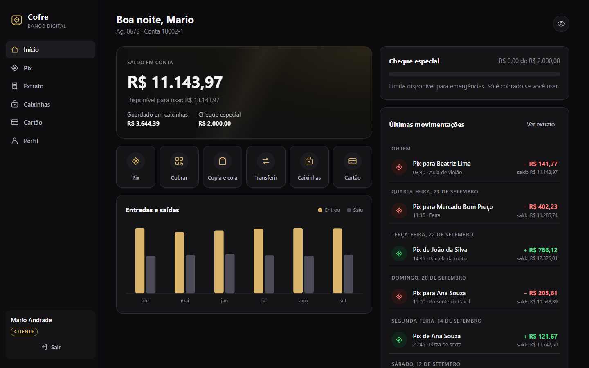

## Experimente em 1 minuto

```bash
docker compose up --build
```

Abra **http://localhost:5230** e use os botões de demonstração da tela de login (senha de todos: `Cofre@2026`):

| Perfil | Login | O que ver |
|---|---|---|
| Cliente | `mario@cofre.dev` | Pix por chave, QR Code, copia e cola, caixinhas, cartão virtual |
| Cliente no limite | `joao@cofre.dev` | Cheque especial em uso e juros cobrados por dia |
| Caixa | `caixa@cofre.dev` | Depósito e saque em espécie no balcão |
| Gerente | `gerente@cofre.dev` | Indicadores, abertura de conta, limites, bloqueios e auditoria |

Sem Docker: `mvn spring-boot:run` (JDK 21 + Maven; o banco H2 é criado em `~/.cofre`). No Windows, o atalho `Abrir Cofre.cmd` faz tudo e abre o navegador. A documentação interativa da API fica em **/swagger-ui.html**.

## O que tem dentro

### App do cliente
- **Pix** por CPF, e-mail, celular ou chave aleatória, com **confirmação do destinatário** (nome e CPF mascarado) antes de enviar.
- **Cobrança com QR Code** no padrão **BR Code (EMV) do Banco Central**, com CRC16, e pagamento por **copia e cola**.
- **Limites do Pix por período**: R$ 1.000,00 das 20h às 6h, como na regra do Banco Central, e R$ 20.000,00 de dia.
- **Comprovantes** com autenticação no formato *end-to-end ID* do Pix (32 caracteres), prontos para imprimir ou salvar em PDF.
- **Cheque especial**: o saldo pode ficar negativo até o limite, com **juros de 8% ao mês cobrados por dia** por uma rotina agendada e idempotente.
- **Conta poupança** aberta pelo próprio app: rende **0,5% ao mês no aniversário** (o dia da abertura; contas abertas de 29 a 31 rendem no dia 1, como na regra real), não tem cheque especial e tem atalhos para **guardar e resgatar**.
- **Caixinhas** com meta e progresso. Só dinheiro próprio vai para a caixinha, nunca o limite.
- **Cartão virtual** com número válido pelo algoritmo de Luhn e **CVV dinâmico** que muda a cada 5 minutos (HMAC-SHA256; o CVV não é guardado em lugar nenhum).
- **Extrato** por período, com saldo anterior, totais e **exportação CSV** pronta para o Excel.
- **Modo privacidade** (ícone do olho) para esconder os valores na tela.

### Agência
- **Caixa**: busca por nome, CPF ou conta; depósito e saque em espécie.
- **Gerente**: painel de indicadores (custódia, limite concedido e em uso, volume de Pix do dia), abertura de conta com **senha provisória** (troca obrigatória no primeiro acesso), limite do cheque especial, bloqueio com motivo, encerramento, redefinição de senha e **auditoria** de todas as ações.
- **Terminal da agência**: `java -jar cofre.jar --terminal`, com login de caixa ou gerente. É a evolução do desafio original ([java-conta-terminal](https://github.com/barbozadevti/java-conta-terminal)) e mantém as mesmas perguntas na abertura de conta.

<table>
  <tr>
    <td>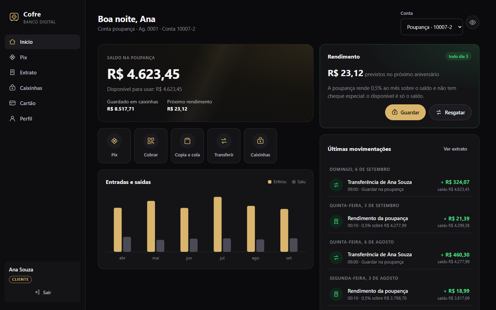</td>
    <td>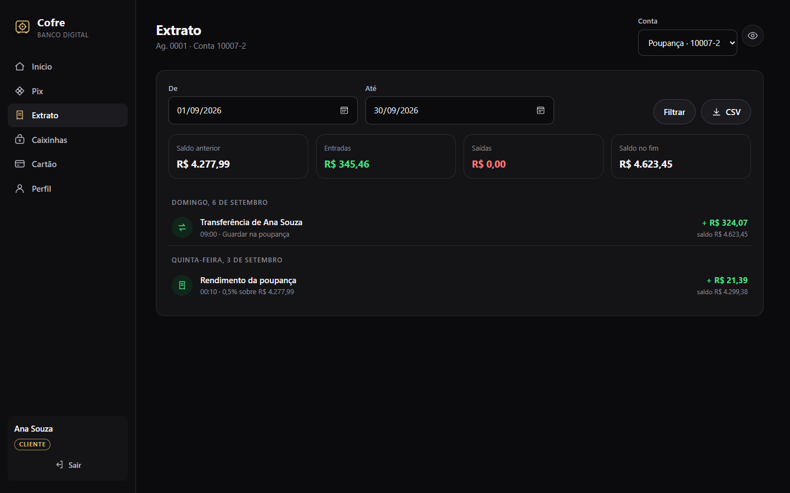</td>
  </tr>
  <tr>
    <td>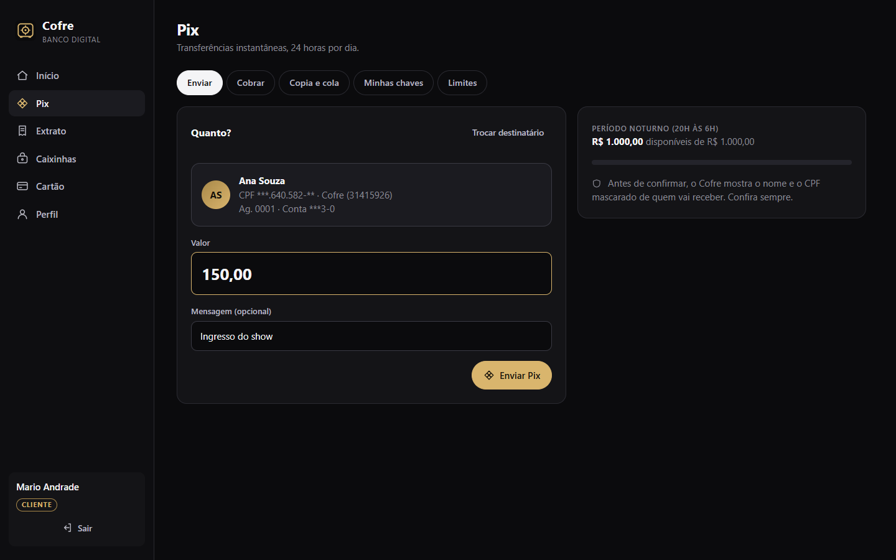</td>
    <td>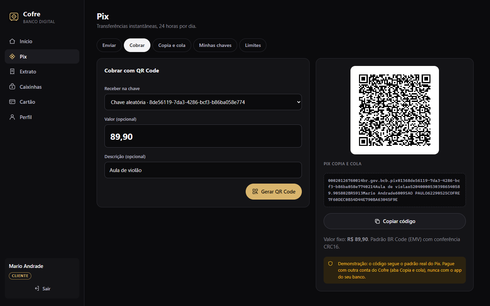</td>
  </tr>
  <tr>
    <td>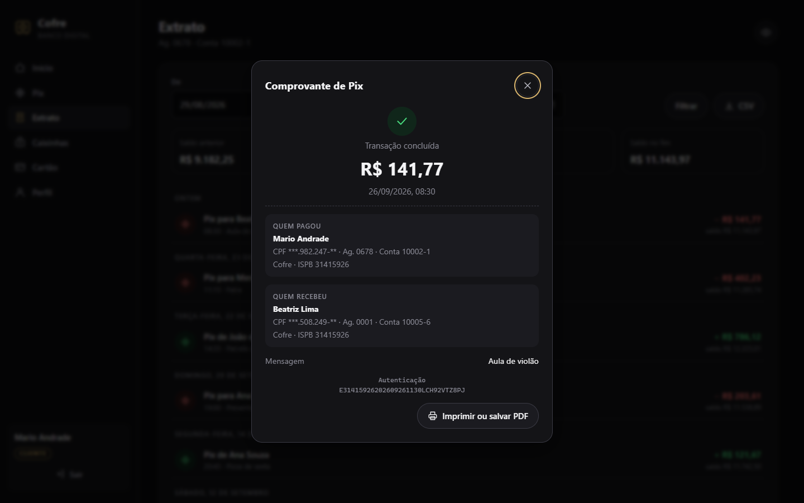</td>
    <td>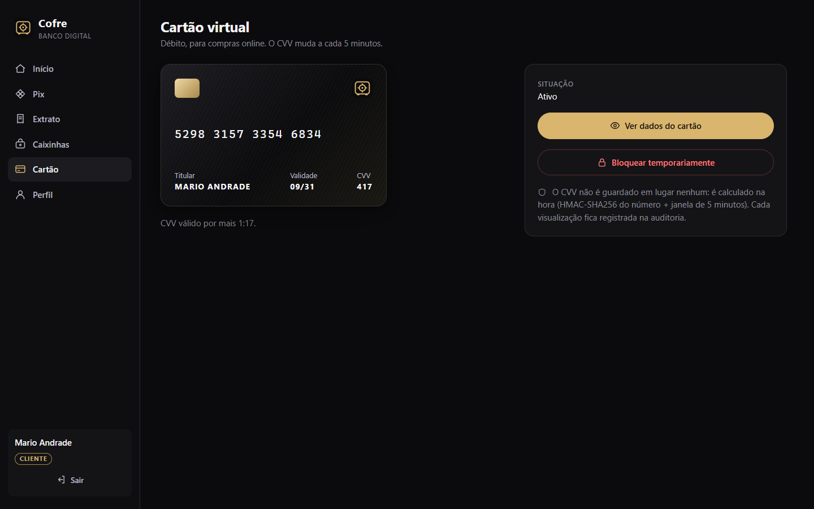</td>
  </tr>
  <tr>
    <td>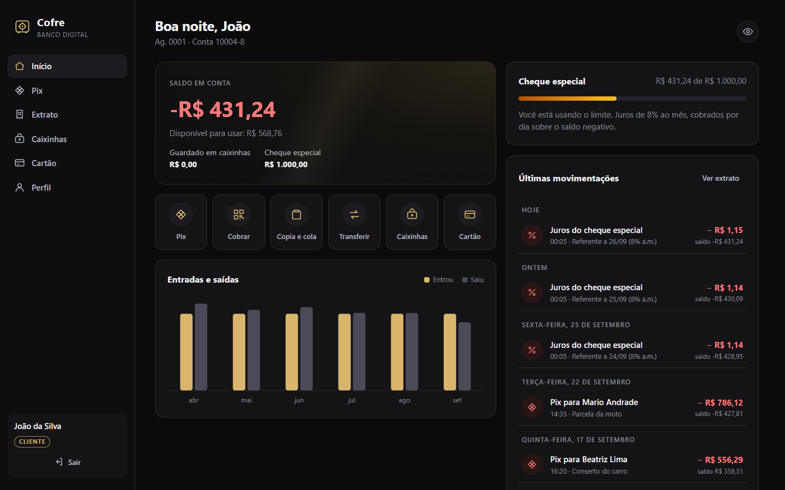</td>
    <td>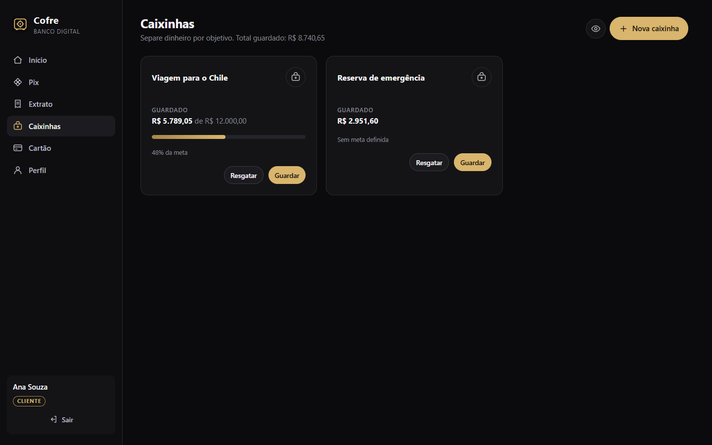</td>
  </tr>
  <tr>
    <td>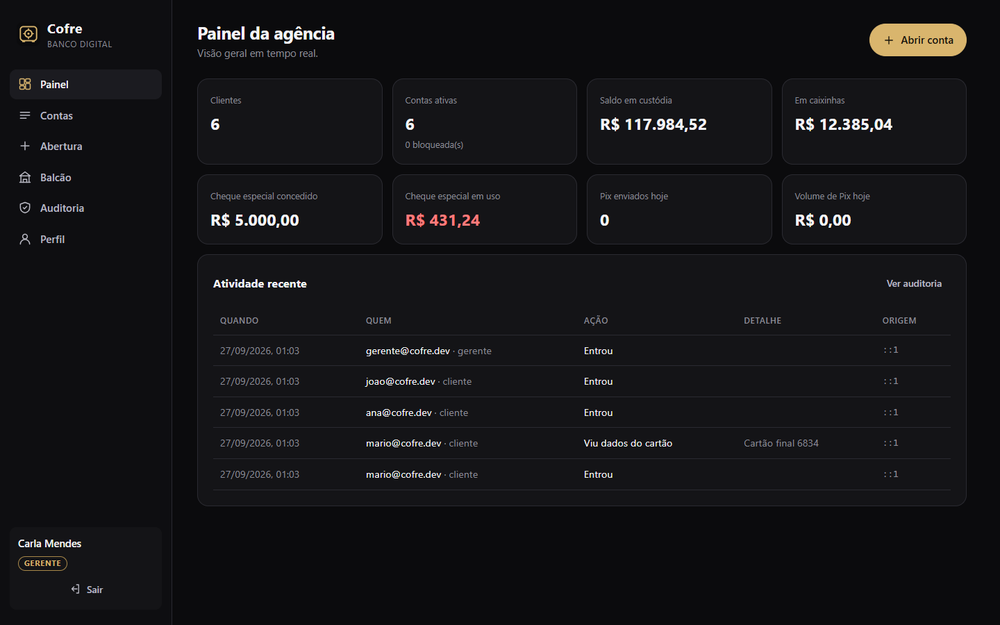</td>
    <td>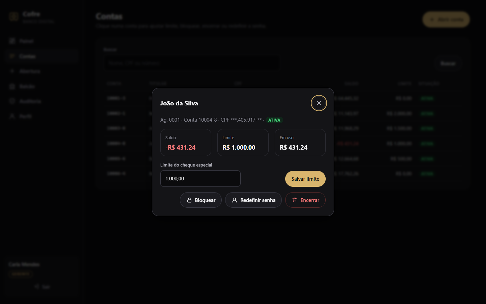</td>
  </tr>
  <tr>
    <td>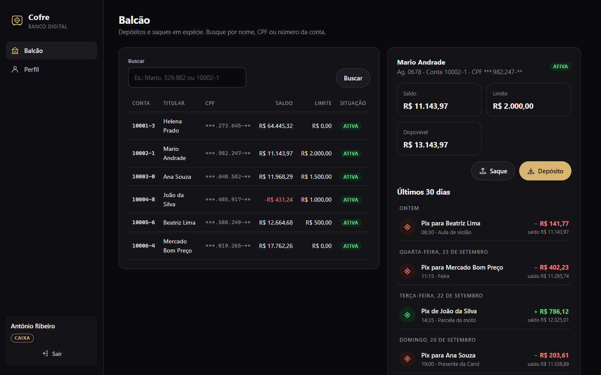</td>
    <td>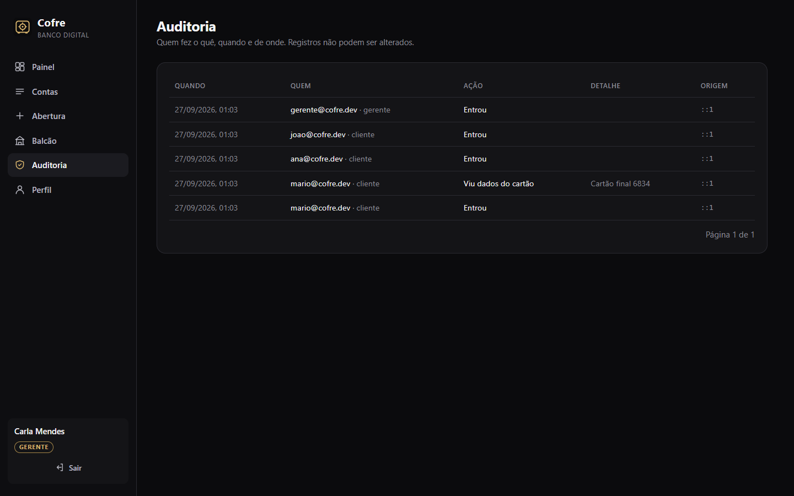</td>
  </tr>
</table>

<p align="center">
  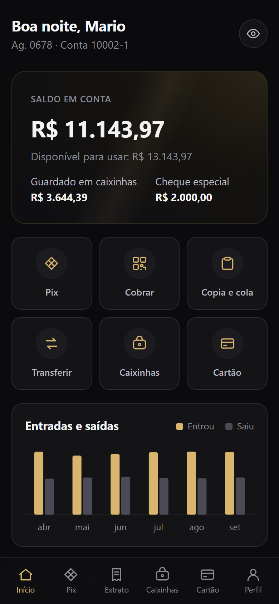
  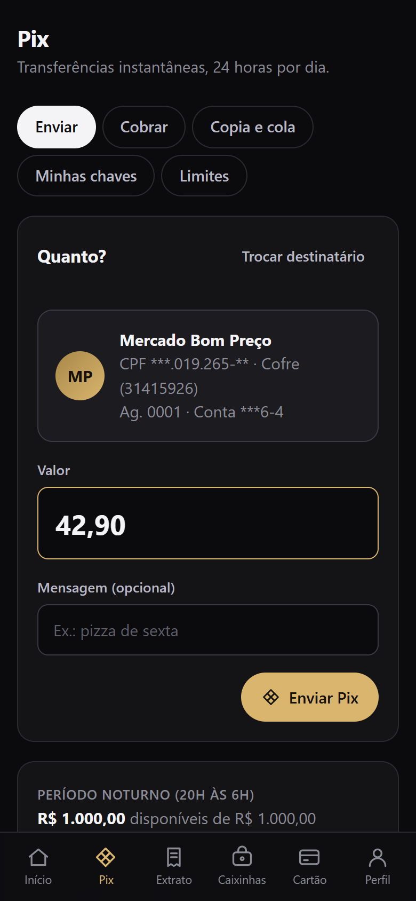
  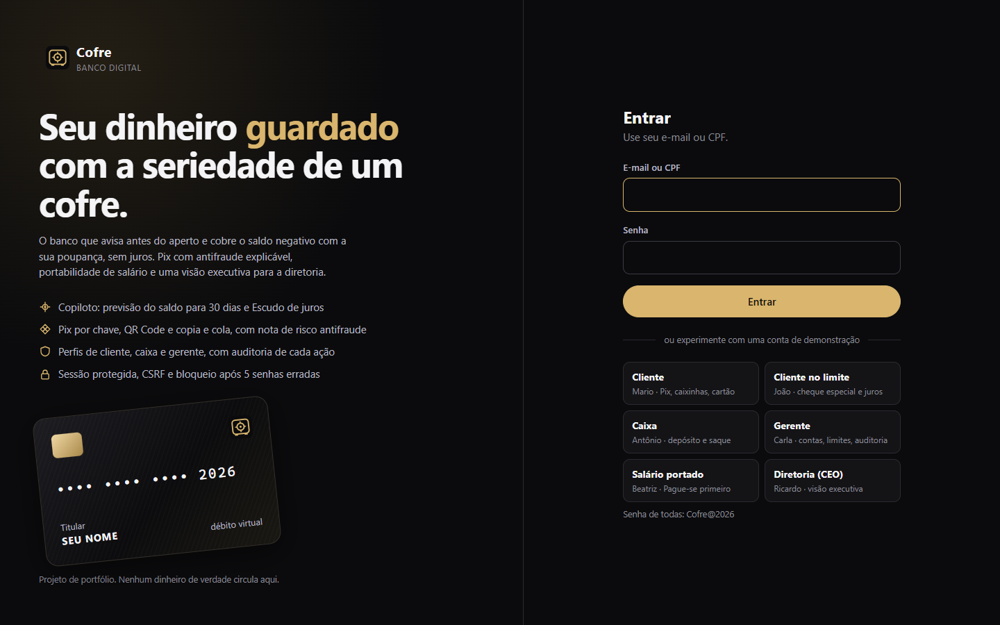
</p>

## Orientação a objetos: corrente e poupança

O Cofre nasceu de dois desafios de Java: a [conta no terminal](https://github.com/barbozadevti/java-conta-terminal) e o [banco digital com os pilares da orientação a objetos](https://github.com/barbozadevti/java-banco-digital-poo). Do segundo vieram os dois tipos de conta, agora com JPA:

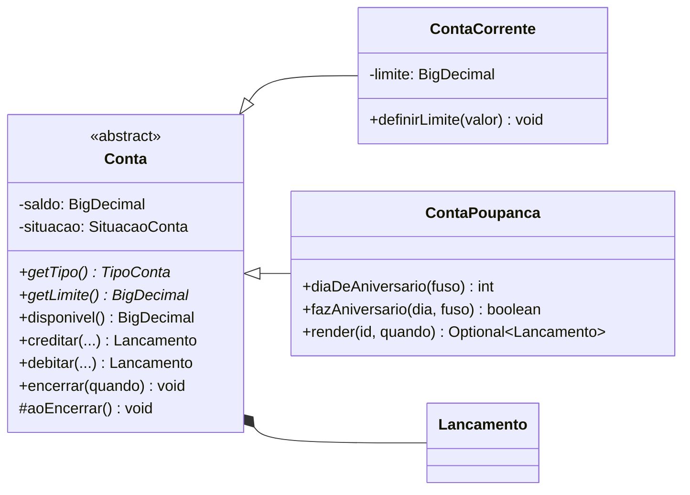
```mermaid
classDiagram
    direction LR
    class Conta {
        <<abstract>>
        -saldo: BigDecimal
        -situacao: SituacaoConta
        +getTipo()* TipoConta
        +getLimite()* BigDecimal
        +disponivel() BigDecimal
        +creditar(...) Lancamento
        +debitar(...) Lancamento
        +encerrar(quando) void
        #aoEncerrar() void
    }
    class ContaCorrente {
        -limite: BigDecimal
        +definirLimite(valor) void
    }
    class ContaPoupanca {
        +diaDeAniversario(fuso) int
        +fazAniversario(dia, fuso) boolean
        +render(id, quando) Optional~Lancamento~
    }
    Conta <|-- ContaCorrente
    Conta <|-- ContaPoupanca
    Conta *-- Lancamento
```

| Pilar | No código |
|---|---|
| **Abstração** | `Conta` é abstrata e diz o que toda conta tem (saldo, situação, extrato); não existe "conta genérica". |
| **Encapsulamento** | O saldo só muda por `creditar` e `debitar`, que validam a operação e devolvem o lançamento do extrato. |
| **Herança** | `ContaCorrente` e `ContaPoupanca` herdam numeração, extrato, bloqueio e encerramento. No banco, as duas ficam na mesma tabela, diferenciadas pela coluna `tipo` (herança JPA em tabela única, migração `V2`). |
| **Polimorfismo** | `getLimite()` é o cheque especial na corrente e zero na poupança. Por isso `disponivel()`, Pix, saque e transferência funcionam nas duas sem nenhum `if` de tipo. O encerramento chama o gancho `aoEncerrar()`, que zera o limite só na corrente. |

Onde o tipo importa de verdade (limite do cheque especial, cartão de débito, campos da poupança na API), o código usa *pattern matching* do Java 21 (`conta instanceof ContaCorrente corrente`). O rendimento roda na mesma rotina diária dos juros e é idempotente: o id `REND-<conta>-<ano><mês>` impede pagar duas vezes no mesmo mês.

## Decisões de engenharia

| Problema | Decisão |
|---|---|
| Centavos que somem | `BigDecimal` com 2 casas em todo o domínio. Um teste confere que 10 depósitos de R$ 0,10 dão exatamente R$ 1,00. |
| Saldo e extrato divergindo | Só a entidade `Conta` altera o saldo, e cada alteração devolve o `Lancamento` correspondente, com o saldo após a operação. |
| Dois saques ao mesmo tempo | Controle de concorrência otimista (`@Version`). Um teste dispara 20 saques simultâneos e confere que o saldo nunca passa do limite nem perde lançamentos. |
| Clique duplo no "Enviar Pix" | Cabeçalho **`Idempotency-Key`**: a mesma chave devolve o comprovante da primeira operação, garantido por uma restrição única no banco. |
| Transferência pela metade | Débito e crédito na mesma transação: ou as duas contas mudam, ou nenhuma. |
| Descobrir contas de outros clientes | Conta alheia responde **404** (e não 403), para não revelar que o número existe. |
| Regras de acesso espalhadas | O perfil é checado nos serviços, e não só nas rotas, então vale igual no site, na API e no terminal. |
| Dois tipos de conta sem duplicar código | `Conta` abstrata com herança JPA em tabela única; o comportamento que muda (limite, disponível, encerramento) fica em métodos sobrescritos. |
| Juros cobrados duas vezes | O id da transação de juros é derivado da conta e do dia (`JUROS-10004-8-20260926`): rodar a rotina de novo não duplica. |
| Senha fraca ou vazada | BCrypt, política de senha, **bloqueio de 15 minutos após 5 erros**, mensagem única para "usuário não existe" e "senha errada" (com o mesmo tempo de resposta) e troca obrigatória da senha provisória. |
| Sessão ou JWT? | **Sessão com cookie HttpOnly + SameSite e CSRF no padrão SPA.** Para um app servido pelo próprio backend, é mais seguro que guardar JWT no navegador e permite encerrar a sessão no servidor. |
| XSS e clickjacking | Content Security Policy sem scripts nem estilos inline, `X-Frame-Options: DENY`, `Cache-Control: no-store` nas respostas da API. |
| QR Code de demonstração lido por um banco real | Os dados de exemplo usam só chaves de e-mail e aleatórias, e a tela avisa para pagar com outra conta do Cofre. |

## Arquitetura

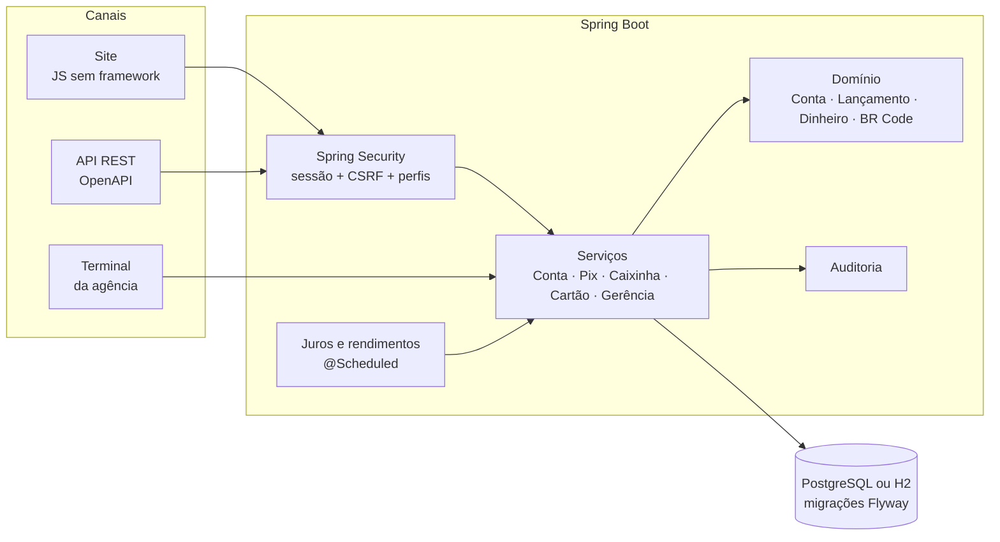
```mermaid
flowchart LR
  subgraph Canais
    WEB[Site<br>JS sem framework]
    API[API REST<br>OpenAPI]
    TERM[Terminal<br>da agência]
  end
  subgraph Spring Boot
    SEG[Spring Security<br>sessão + CSRF + perfis]
    SRV[Serviços<br>Conta · Pix · Caixinha · Cartão · Gerência]
    DOM[Domínio<br>Conta · Lançamento · Dinheiro · BR Code]
    AUD[Auditoria]
    JOB[Juros e rendimentos<br>@Scheduled]
  end
  DB[(PostgreSQL ou H2<br>migrações Flyway)]
  WEB --> SEG --> SRV
  API --> SEG
  TERM --> SRV
  SRV --> DOM
  SRV --> AUD
  JOB --> SRV
  SRV --> DB
```

```
src/main/java/dev/barboza/cofre/
├── dominio/     Conta (abstrata), ContaCorrente, ContaPoupanca, Lancamento, Cliente, Dinheiro, Cpf, NumeroConta
├── servico/     ContaService, GerenciaService, PainelService, JurosChequeEspecial, RendimentoPoupanca, Acesso
├── pix/         PixService, ChavePix, BrCode (EMV + CRC16), QrCodeSvg
├── caixinha/    Caixinha e serviço
├── cartao/      Cartão virtual, Luhn e CVV dinâmico
├── seguranca/   Usuário, perfis, login com bloqueio, Spring Security
├── auditoria/   Registro de eventos
├── api/         Controllers REST, DTOs, CSV e erros em problem+json
├── terminal/    Terminal da agência
└── config/      Dados de demonstração, agendador, OpenAPI
src/main/resources/
├── db/migration/   Migrações Flyway
└── static/         Site (HTML, CSS e módulos JavaScript)
```

## Testes

```bash
mvn verify
```

**114 testes**, rodando com o idioma da máquina em português para pegar qualquer formatação que dependa dele. No CI, a mesma bateria roda também contra o **PostgreSQL**, e um terceiro job sobe o **Docker Compose** e faz login de verdade.

| Área | Exemplos do que é verificado |
|---|---|
| Domínio | Cheque especial, bloqueio, encerramento, juros, CPF, celular, dígito da conta, formato do id de transação |
| Poupança | Disponível sem limite, aniversário (inclusive 29 a 31 virando dia 1), rendimento com arredondamento bancário, crédito idempotente, uma poupança por cliente, sem limite e sem cartão |
| BR Code | Gera **exatamente** o exemplo da documentação do Pix (CRC `1D3D`), lê, e recusa código alterado |
| Pix | Chaves (tipos, limite de 5, duplicidade), consulta com CPF mascarado, limite noturno com relógio controlado, copia e cola |
| Segurança | 401 sem login, 403 sem CSRF, cada perfil só na sua área, 404 para conta alheia, bloqueio após 5 senhas erradas, trava da senha provisória |
| API | Login real com sessão, idempotência do Pix, `problem+json`, CSV byte a byte |
| Concorrência | 20 saques simultâneos na mesma conta |
| Terminal | Roteiros de caixa e gerente, abertura com as perguntas do desafio original |
| Demonstração | Seis meses de histórico, duas poupanças rendendo todo mês e um cliente no cheque especial com juros |

Os valores esperados de CPF, dígito verificador e BR Code vêm de fontes independentes (documentação do Banco Central e uma implementação separada), não do próprio código testado.

## API

40 rotas, documentadas em `/swagger-ui.html`. Os erros seguem a RFC 9457 (`application/problem+json`), em português:

| Situação | Status |
|---|---|
| Sem login | 401 |
| Perfil sem permissão ou sem token CSRF | 403 |
| Conta, chave, caixinha ou comprovante inexistente (ou de outro cliente) | 404 |
| Duas operações simultâneas na mesma conta | 409 |
| Acesso bloqueado por tentativas | 423 |
| Regra de negócio (saldo, limite do Pix, conta bloqueada...) | 422 |

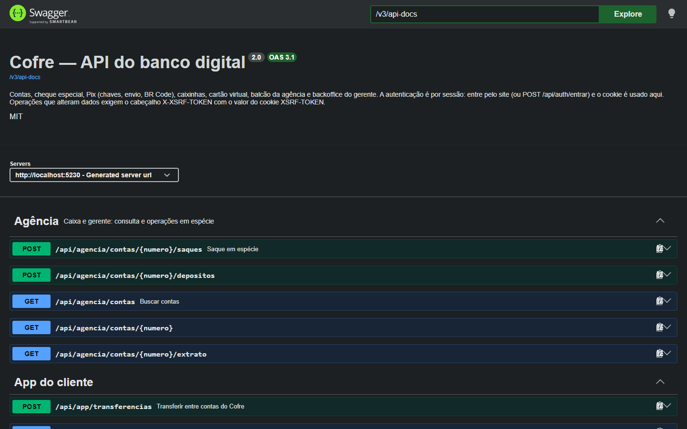

## Produto

As decisões de escopo e a ordem das entregas estão na [Lean Inception](docs/lean-inception.md). Das nove ondas planejadas, oito já foram entregues.
