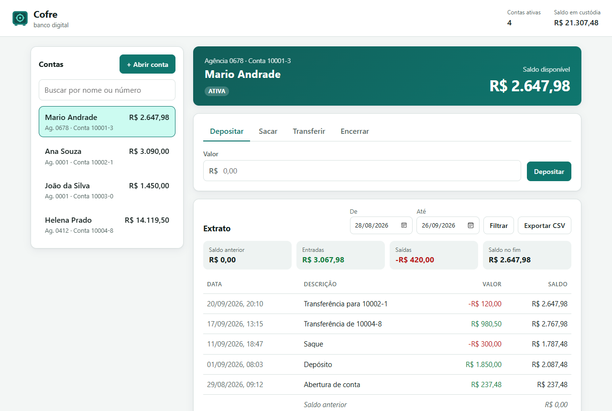
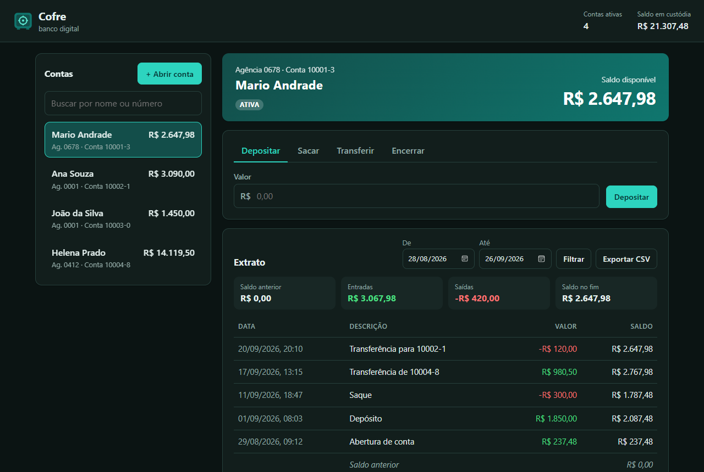
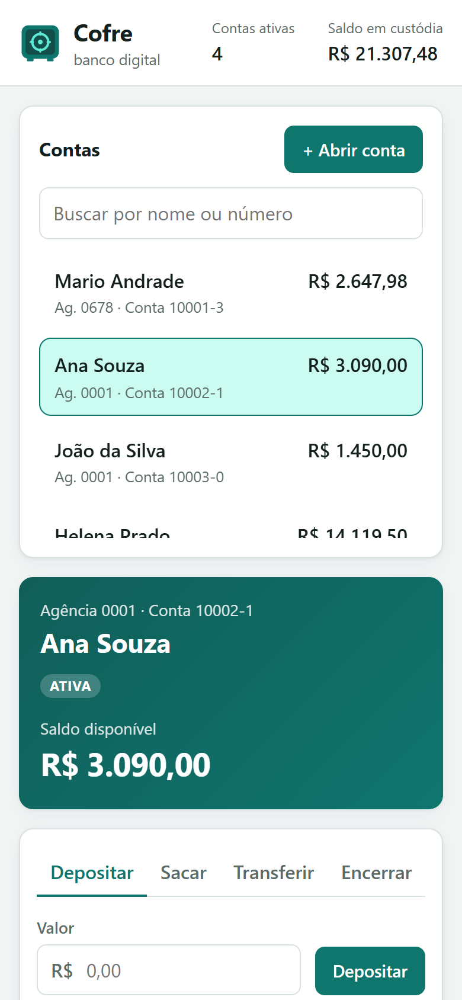
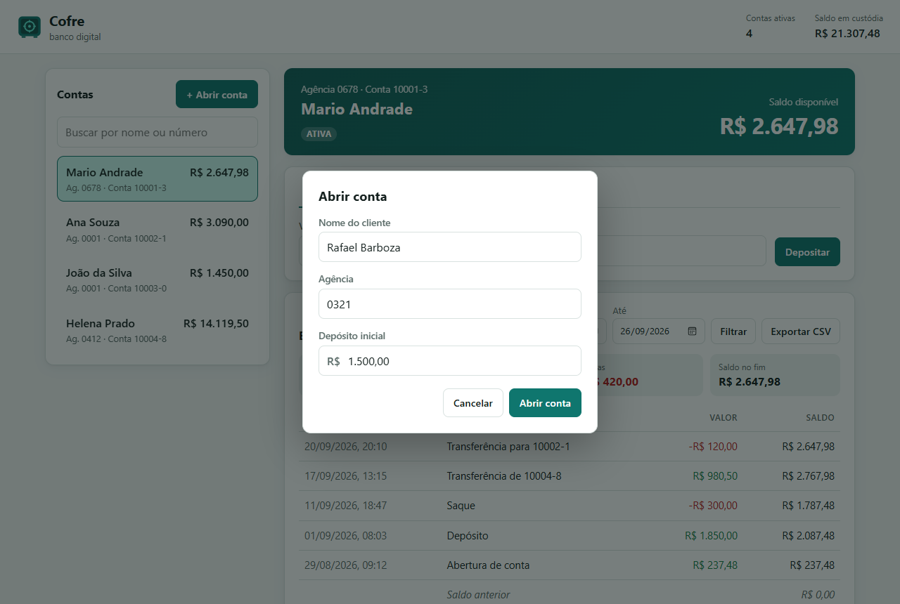
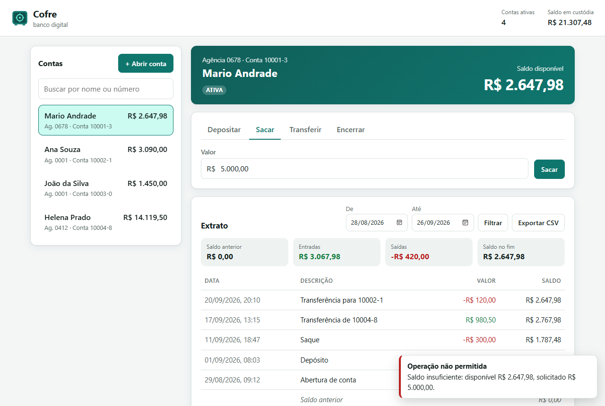

<p align="center">
  
</p>

<h1 align="center">Cofre</h1>

<p align="center">
  Banco digital com <b>API REST</b>, <b>site</b> e <b>terminal</b>: contas, depósitos, saques, transferências e extrato.<br>
  Java 21 · Spring Boot 4 · JPA/Hibernate · H2 · JavaScript sem framework
</p>

<p align="center">
  <a href="https://github.com/barbozadevti/cofre/actions/workflows/ci.yml"></a>
</p>



## Por que existe

O Cofre nasceu do desafio **"Simulando uma Conta Bancária Através do Terminal"** (entrega original em [barbozadevti/java-conta-terminal](https://github.com/barbozadevti/java-conta-terminal)), que lê número, agência, nome e saldo e mostra uma mensagem de boas-vindas.

Aqui a ideia foi além: tratar a conta como um sistema de verdade, em que **o saldo nunca pode ficar errado**.

- **Dinheiro em `BigDecimal`**, nunca `double`: 10 depósitos de R$ 0,10 dão exatamente R$ 1,00.
- **Regras no domínio:** saque e transferência só com saldo; conta encerrada não movimenta; só encerra com saldo zero.
- **Saldo e extrato não divergem:** toda mudança de saldo acontece na entidade `Conta`, que devolve o lançamento correspondente.
- **Transferência atômica:** ou as duas contas mudam, ou nenhuma muda.
- **Concorrência:** controle otimista (`@Version`). Há um teste com 20 saques simultâneos que confere que o saldo nunca fica negativo nem perde lançamentos.
- **Mesmo núcleo, três canais:** site, API e terminal passam pelo mesmo `ContaService`.

## Funcionalidades

| | |
|---|---|
| **Abrir conta** | Agência de 4 dígitos, número sequencial com dígito verificador (módulo 11) e a mensagem do desafio original |
| **Depositar e sacar** | Valor positivo, até 2 casas decimais, limite de R$ 1.000.000,00 por operação |
| **Transferir** | Entre contas ativas, com os dois lançamentos no extrato |
| **Extrato** | Filtro por período, saldo anterior, entradas, saídas e saldo após cada lançamento |
| **Exportar CSV** | Pronto para o Excel (UTF-8 com BOM, `;`, vírgula decimal, proteção contra injeção de fórmula) |
| **Encerrar conta** | Só com saldo zero |
| **Terminal** | Menu numerado que repete a pergunta quando o valor digitado é inválido |
| **Demonstração** | Na primeira execução, cria 4 contas com um mês de movimentação |

<table>
  <tr>
    <td></td>
    <td width="30%"></td>
  </tr>
  <tr>
    <td></td>
    <td></td>
  </tr>
</table>

## Terminal

```text
=== COFRE | terminal da agência ===

1) Abrir conta      2) Depositar     3) Sacar
4) Transferir       5) Extrato       6) Listar contas
0) Sair
Escolha uma opção:
1
Por favor, digite o número da Agência ! (Enter para 0001)
0678
Por favor, digite o nome do Cliente !
Mario Andrade
Por favor, digite o saldo !
abc
Valor inválido: use números, por exemplo 150,75.
Por favor, digite o saldo !
237,48
Olá Mario Andrade, obrigado por criar uma conta em nosso banco, sua agência é 0678, conta 10005-6 e seu saldo R$ 237,48 já está disponível para saque.
```

O site e o terminal podem ficar abertos ao mesmo tempo sobre os mesmos dados (H2 em modo `AUTO_SERVER`).

## API

| Método | Rota | Descrição |
|---|---|---|
| `GET` | `/api/contas` | Lista as contas |
| `POST` | `/api/contas` | Abre conta: `{"titular", "agencia", "saldoInicial"}` |
| `GET` | `/api/contas/{numero}` | Consulta (aceita `10001-3` ou `100013`) |
| `POST` | `/api/contas/{numero}/depositos` | `{"valor": 150.75}` |
| `POST` | `/api/contas/{numero}/saques` | `{"valor": 150.75}` |
| `POST` | `/api/transferencias` | `{"origem", "destino", "valor"}` |
| `GET` | `/api/contas/{numero}/extrato?de=AAAA-MM-DD&ate=AAAA-MM-DD` | Extrato (padrão: últimos 30 dias) |
| `GET` | `/api/contas/{numero}/extrato.csv` | Extrato em CSV |
| `DELETE` | `/api/contas/{numero}` | Encerra a conta |
| `GET` | `/health` | Saúde da aplicação |

Os erros seguem a RFC 9457 (`application/problem+json`), em português:

```json
{
  "title": "Operação não permitida",
  "status": 422,
  "detail": "Saldo insuficiente: disponível R$ 80,00, solicitado R$ 100,00.",
  "instance": "/api/contas/10001-3/saques"
}
```

| Situação | Status |
|---|---|
| Campo obrigatório ausente, JSON ou data mal formados | 400 |
| Conta não encontrada | 404 |
| Duas operações simultâneas na mesma conta | 409 |
| Regra de negócio (saldo, conta encerrada, dígito verificador...) | 422 |

## Como rodar

Requer o **JDK 21** e o **Maven**. Não precisa instalar banco de dados: o H2 grava em `~/.cofre`.

```bash
mvn spring-boot:run
```

Abra http://localhost:5230. Para o modo terminal:

```bash
mvn -q package -DskipTests
java -jar target/cofre.jar --terminal
```

No Windows, os atalhos `Abrir Cofre.cmd` (site) e `Abrir Cofre Terminal.cmd` fazem tudo isso: procuram o Java 21, compilam na primeira vez e abrem o navegador quando o servidor fica pronto.

## Testes

```bash
mvn verify
```

77 testes, rodando com o idioma da máquina em português (`pt-BR`) para pegar qualquer formatação que dependa dele:

| Camada | O que cobre |
|---|---|
| Domínio | Formatação e leitura de valores, dígito verificador, regras de saldo, transferência, encerramento |
| Serviço | Numeração, extrato por período com saldo anterior, transferência que falha sem efeito colateral |
| API (MockMvc) | Status HTTP, `problem+json`, CSV byte a byte, validação |
| Terminal | Roteiros completos de entrada e saída, erros de digitação, fim de entrada |
| Concorrência | 20 saques simultâneos na mesma conta |
| Demonstração | Saldos das contas de exemplo |

O relógio é injetado (`java.time.Clock`), então os testes usam uma data fixa. Os dígitos verificadores esperados foram calculados por uma implementação independente, e não pelo próprio código testado.

## Estrutura

```
src/main/java/dev/barboza/cofre/
├── dominio/    Conta, Lancamento, Dinheiro, NumeroConta, exceções e repositórios
├── servico/    ContaService (casos de uso) e Extrato
├── api/        ContaController, DTOs, CSV e tratamento de erros
├── terminal/   TerminalBancario (menu no console)
└── config/     relógio, dados de demonstração, abertura do navegador
src/main/resources/static/   site (HTML, CSS e JS sem framework)
docs/lean-inception.md       visão, personas, jornadas e ondas do produto
```

## Produto

As decisões de escopo estão na [Lean Inception](docs/lean-inception.md). As ondas 1 a 4 estão entregues: núcleo, site, terminal, encerramento, filtro e exportação. As próximas são cheque especial com login e perfis, e depois PIX simulado.
